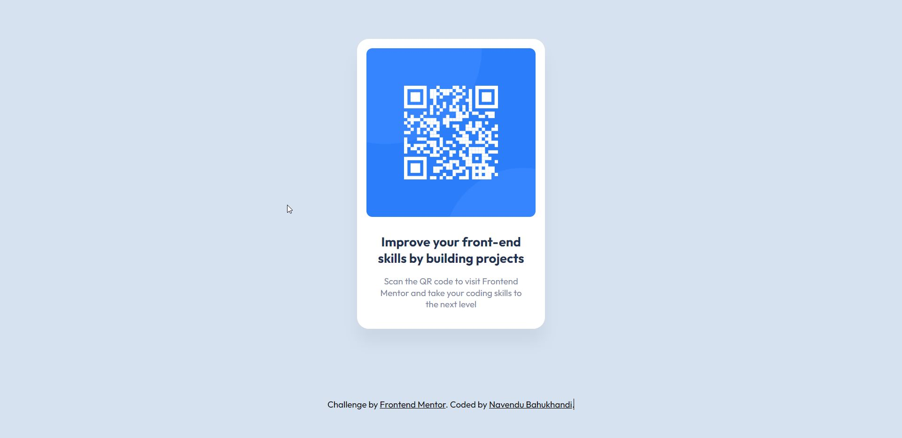

# Frontend Mentor - QR code component solution

This is a solution to the [QR code component challenge on Frontend Mentor](https://www.frontendmentor.io/challenges/qr-code-component-iux_sIO_H).

## Table of contents

- [Overview](#overview)
  - [Screenshot](#screenshot)
  - [Links](#links)
- [My process](#my-process)
  - [Built with](#built-with)
  - [What I learned](#what-i-learned)
  - [Continued development](#continued-development)
  - [Useful resources](#useful-resources)
- [Author](#author)
- [Acknowledgments](#acknowledgments)

## Overview

### Screenshot

### Links

- Solution URL: (https://github.com/Ashxarya/qr-code-component-main)
- Live Site URL: (https://qrcode-ashwarya.netlify.app/)

## My process

This project was fairly straightforward, i used html to place down 3 elements (an image, an h1 and a p element) into a div. From there CSS was used to style the rest. 

### Built with

- Semantic HTML5 markup
- CSS custom properties
- CSS Grid

### What I learned

I learned how to make a very basic card and how to center and size different elements inside said card.
I also learned how to add box shadows.
I figured out how to deploy builds onto netlify through github.

### Continued development

I would like to continue focussing on flexbox and grid to understand how to organize and align elements in different sections better.

### Useful resources

- [Kevin Powell](https://www.youtube.com/watch?v=B2WL6KkqhLQ&t=817s)
  I used this video to understand how to place colours into the beggining of CSS using root, and how to make and organize cards in general.